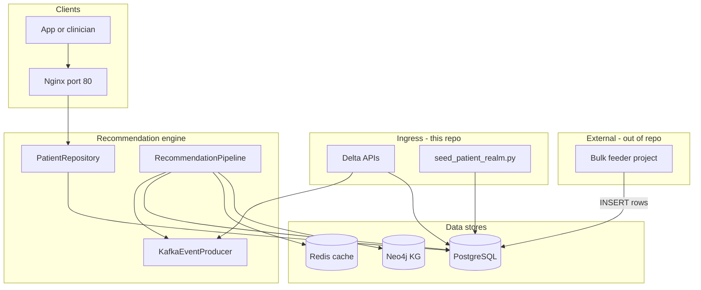
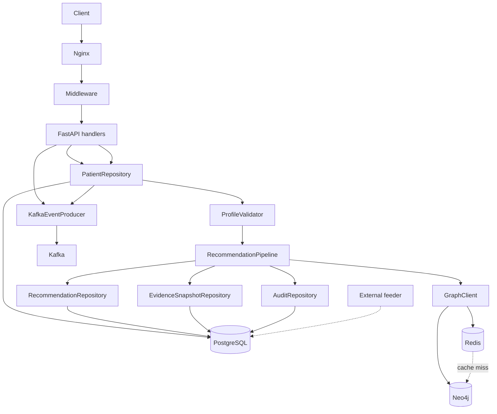
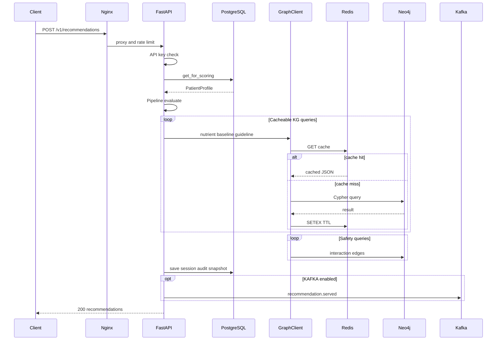
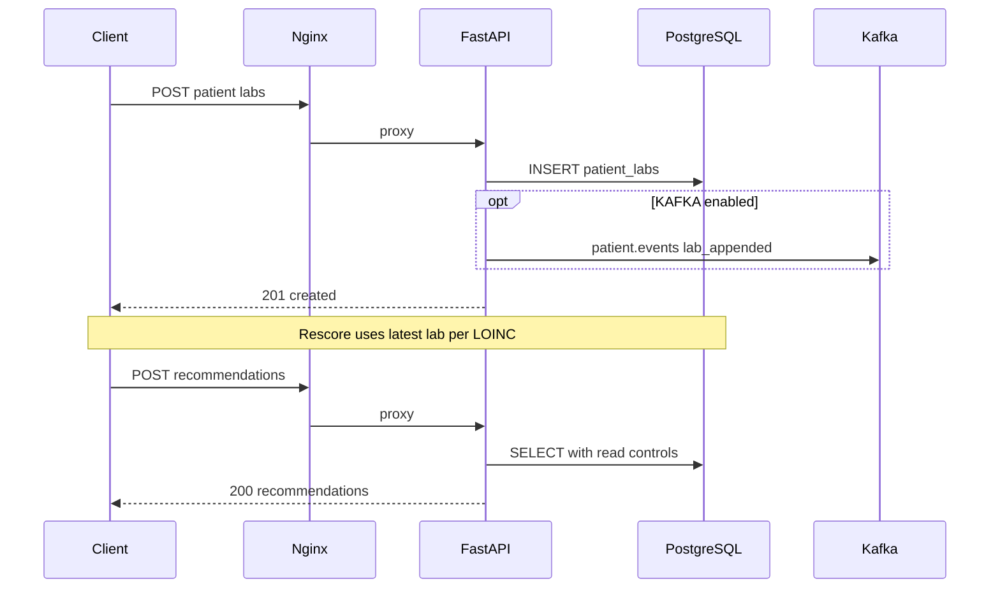

# Supplement Recommendation Engine — Master Reference

> **Purpose:** Single source of truth for what is shipped, how to run it, how components connect, and what to do next.  
> **Audience:** Engineers, clinicians reviewing pilot output, and the external feeder project team.  
> **Last updated:** June 2026 (Phase 1 → 2c-M2 complete)

---

## Table of contents

1. [Product deliverable summary](#1-product-deliverable-summary)
2. [Architecture at a glance](#2-architecture-at-a-glance)
3. [Technology stack — roles, triggers, and interactions](#3-technology-stack--roles-triggers-and-interactions)
4. [What was implemented (by phase)](#4-what-was-implemented-by-phase)
5. [Environment setup](#5-environment-setup)
6. [Docker services — how to interact](#6-docker-services--how-to-interact)
7. [Databases — how to interact](#7-databases--how-to-interact)
8. [API reference](#8-api-reference)
9. [Scoring pipeline — function chain](#9-scoring-pipeline--function-chain)
10. [User stories → implementation map](#10-user-stories--implementation-map)
11. [Validation gates (scripts)](#11-validation-gates-scripts)
12. [Pilot cohort (test patients)](#12-pilot-cohort-test-patients)
13. [External bulk feeder contract](#13-external-bulk-feeder-contract)
14. [Recommended next phases](#14-recommended-next-phases)
15. [Key file index](#15-key-file-index)

---

## 1. Product deliverable summary

The **Supplement Recommendation Engine** is a clinical decision support system that:

- Reads normalized **patient state from PostgreSQL** (demographics, conditions, meds, labs)
- Reads **clinical evidence from Neo4j** (nutrient–disease–drug edges, guidelines, baselines)
- Runs a **7-stage Bayesian scoring pipeline** with a **deterministic safety gate**
- Persists **immutable recommendation sessions**, **audit logs**, and **evidence snapshots**
- Exposes a **FastAPI HTTP API** behind Nginx

**Production posture (pilot-ready):**

| Capability | Status |
|------------|--------|
| Score by `patient_id` only | Shipped (Phase 2a) |
| Delta ingest APIs (labs, meds, conditions) | Shipped (Phase 2a) |
| API key auth + inline patient disabled in prod | Shipped (Phase 2b M1) |
| Readiness probes + evidence content hash | Shipped (Phase 2b M2) |
| JSON request logging (no raw PHI) | Shipped (Phase 2b M4) |
| 7-patient pilot cohort + gate | Shipped (Phase 2b pilot) |
| Kafka producers (`patient.events`, `recommendation.served`) | Shipped (Phase 2c M1) |
| Longitudinal personalization (`drs_snapshot`) | Shipped (Phase 2c M2, flag-gated) |
| Bulk patient load from warehouse **in this repo** | **Out of scope** — external project writes Postgres |
| OLAP analytics mart | Not built (optional future) |
| FHIR lab parser | Not built (optional future) |

---

## 2. Architecture at a glance

> **Diagrams:** Standard Markdown preview (including Cursor) often **does not render Mermaid**. Use either:
> - **Browser:** open [`ENGINE_DIAGRAMS.html`](ENGINE_DIAGRAMS.html) (all flowcharts + sequence diagrams)
> - **GitHub:** push the repo — Mermaid renders on github.com
> - **VS Code:** install extension *Markdown Preview Mermaid Support*

### ASCII overview (always visible)

```
  [External feeder] ----INSERT rows------------------------+
                                                          v
  [Client] --> [Nginx :80] --> [FastAPI API] --> [PatientRepository] --> [PostgreSQL]
                                      |                    ^
                                      |                    | seed / delta APIs
                                      v                    |
                               [RecommendationPipeline] -----+
                                      |
                    +-----------------+------------------+
                    v                 v                  v
               [Neo4j KG]        [Redis cache]    [Kafka optional]
                    ^                 |
                    +---- cache miss -+
```



**Non-negotiable boundary:** The engine **never** queries an upstream warehouse at score time. It only reads Postgres + Neo4j.

---

## 3. Technology stack — roles, triggers, and interactions

Each component below is a Docker service or runtime dependency. This section explains **what it does in our app**, **when it is used**, and **what triggers it**.

### Component roles

| Technology | Container / location | Role in this app | When it is triggered |
|------------|----------------------|------------------|----------------------|
| **Nginx** | `supplement_nginx` :80 | Reverse proxy in front of FastAPI. Applies rate limiting (100 req/min/IP on `/v1/`), security headers, and Docker DNS re-resolve so API container rebuilds do not cause 502s. | Every client request to `http://localhost` (port 80). Proxies `/v1/*`, `/health`, `/docs` to `api:8000`. |
| **FastAPI (Uvicorn)** | `supplement_api` :8000 | HTTP API + middleware (API key, JSON logging, request ID). Orchestrates scoring, delta ingest, audit reads. Runs `RecommendationPipeline` per request. | On any HTTP request. **Startup:** connects Neo4j, Postgres pool, Kafka producer, loads active `model_version`. **Shutdown:** closes connections. |
| **PostgreSQL** | `supplement_postgres` :5432 | **Patient realm** (PHI): demographics, conditions, meds, labs. **Engine output:** sessions, recommendations, audit, evidence snapshots, feedback. Source of truth for `patient_id` scoring. | **Read:** every `get_for_scoring`, session history, audit/evidence GET. **Write:** every successful score (session + audit + snapshot), delta APIs, feedback, optional external feeder bulk INSERT. |
| **Neo4j** | `supplement_neo4j` :7474 / :7687 | **Knowledge graph** (no PHI): nutrients, ICD-10 conditions, RxNorm drugs, LR edges, guidelines, baselines. Queried only via `GraphClient`. | **Every score run** — DRS, candidate guidelines, dose rules, safety interactions, evidence snapshot version/stats. **Not** queried for patient demographics. |
| **Redis** | `supplement_redis` :6379 | **Cache layer for Neo4j reads** inside `GraphClient`. Speeds up near-static KG lookups. Graceful fallback to Neo4j if Redis is down. | **On cacheable GraphClient calls** during scoring: `get_nutrient_meta`, `get_baseline_prevalence`, `get_guideline`. **Not** used for interaction/safety edges or patient data. TTL: 1h (nutrient), 24h (baseline/guideline). |
| **Kafka** | `supplement_kafka` :9092 | **Async event bus** (producers only in this repo). Decouples downstream analytics/consumers from the sync API path. | **Only when `KAFKA_ENABLED=1`:** after delta ingest (`patient.events`) and after score persist (`recommendation.served`). No-op if disabled or broker unreachable. |
| **Zookeeper** | `supplement_zookeeper` | Kafka cluster coordination (broker metadata). | Runs whenever Kafka container runs. Not called directly by application code. |
| **Alembic** | Runs inside API container at boot | **Schema migrations** for Postgres (`alembic upgrade head` in `docker-entrypoint.sh`). | **Every API container start** — before Uvicorn workers bind. Ensures `drs_snapshot` and ingest columns exist. |
| **External feeder** | Out of repo | Writes patient rows directly to Postgres tables. Engine treats rows as already present. | Whenever your other project runs bulk load. Engine **does not** observe or trigger the feeder. |
| **Pilot seed script** | `scripts/seed_patient_realm.py` | Dev/pilot convenience — loads 16 fixtures into Postgres (same tables as feeder). | Manual: `python scripts/run_app.py seed --all`. Gate scripts call this before prod tests. |

### Application-layer modules (not separate containers)

| Module | Role | Trigger |
|--------|------|---------|
| `ApiKeyMiddleware` | Requires `X-API-Key` on `/v1/*` when `REQUIRE_API_KEY=1` | Every `/v1/*` request in prod profile |
| `PatientRepository` | SQL ↔ `PatientProfile`; read controls (latest lab/LOINC, active meds/conditions) | Score path + delta APIs |
| `RecommendationPipeline` | 7-stage scoring + optional Stage 1b personalization | `POST /v1/recommendations` |
| `PersonalizationEngine` | Blends prior `drs_snapshot` from last session | Stage 1b when `PERSONALIZATION_ENABLED=1` and prior session exists |
| `KafkaEventProducer` | Publishes JSON events to topics | After delta writes + after session save (if Kafka enabled) |

### Full technology interaction diagram

See [`ENGINE_DIAGRAMS.html`](ENGINE_DIAGRAMS.html) §2 for the interactive version.

### ASCII — score request path

```
Client
  |  HTTP :80
  v
Nginx (rate limit, proxy)
  v
FastAPI middleware (API key, request_id, JSON log)
  v
POST /v1/recommendations
  |-- PatientRepository --> PostgreSQL SELECT (patient realm)
  |-- ProfileValidator
  v
RecommendationPipeline
  |-- GraphClient --> Redis GET (cache hit?) --miss--> Neo4j Cypher
  |-- PersonalizationEngine --> PostgreSQL (prior drs_snapshot) [optional]
  |-- SafetyEngine --> Neo4j (interactions - never cached)
  v
PostgreSQL INSERT: session, recommendations, audit, evidence_snapshot
  |
  +-- Kafka recommendation.served [if KAFKA_ENABLED=1]

Parallel write path (delta APIs):
  POST /v1/patients/{id}/labs|medications|conditions
    --> PostgreSQL INSERT/UPDATE
    --> Kafka patient.events [if enabled]

External feeder (any time):
  Bulk project --> PostgreSQL INSERT (same tables)
```



### Sequence: one recommendation request (prod profile)

See [`ENGINE_DIAGRAMS.html`](ENGINE_DIAGRAMS.html) §3.

```
 1. Client ----POST /v1/recommendations + X-API-Key----> Nginx
 2. Nginx ---------------------------------------------> FastAPI
 3. FastAPI: ApiKeyMiddleware validates key
 4. FastAPI --> PostgreSQL: PatientRepository.get_for_scoring
 5. ProfileValidator + RecommendationPipeline.evaluate
 6. For each cacheable KG key:
      GraphClient --> Redis GET
      if miss: GraphClient --> Neo4j Cypher --> Redis SETEX
 7. For safety: GraphClient --> Neo4j (no Redis)
 8. PostgreSQL: INSERT session, recommendations, audit, evidence_snapshot
 9. Optional: Kafka --> recommendation.served
10. Client <---- 200 JSON (session_id, recommendations)
```



### Sequence: delta lab append (then optional rescore)

See [`ENGINE_DIAGRAMS.html`](ENGINE_DIAGRAMS.html) §4.

```
 1. Client ----POST /v1/patients/{id}/labs----> Nginx --> FastAPI
 2. FastAPI --> PostgreSQL: INSERT patient_labs
 3. Optional: Kafka --> patient.events (lab_appended)
 4. Client <---- 201 created

Later:
 5. Client ----POST /v1/recommendations { patient_id }----> ...
 6. get_for_scoring applies read rule: latest lab per LOINC
```



### What is *not* on the hot path

| Technology | Why it is not in every request |
|------------|--------------------------------|
| Zookeeper | Infrastructure for Kafka only |
| Alembic | Runs once at API container boot, not per request |
| External feeder | Writes asynchronously; engine never calls it |
| Redis | Only consulted for cacheable KG reads; safety path always hits Neo4j |

---

## 4. What was implemented (by phase)

### Phase 1 — MVP

| Item | Location |
|------|----------|
| 7-stage recommendation pipeline | `src/pipelines/recommendation_pipeline.py` |
| Bayesian DRS scorer | `src/core/deficiency_risk_scorer.py` |
| Candidate generator, dose optimizer, confidence | `src/core/candidate_generator.py` |
| Deterministic safety engine | `src/safety/safety_engine.py` |
| Template rationale (why/evidence/safety) | `src/explain/explain_service.py` |
| Neo4j graph client + Redis cache | `src/knowledge/graph_client.py` |
| Postgres repositories + ORM | `src/db/repositories.py`, `src/db/orm_models.py` |
| Alembic migrations | `alembic/versions/001_initial_schema.py` |
| Neo4j clinical seed v1.1.0 | `scripts/neo4j_seed.cypher` |
| Docker stack | `docker-compose.yml` |
| Gate | `scripts/validate_phase1_gate.ps1` |

### Phase 2a — Patient realm + production read path

| Item | Location |
|------|----------|
| `POST /v1/recommendations { patient_id }` | `src/api/app.py` |
| Delta APIs: labs, meds sync, conditions sync | `src/api/app.py` |
| `PatientRepository.get_for_scoring()` + read controls | `src/db/repositories.py` |
| `ProfileValidator` (ICD-10, RxNorm, LOINC) | `src/intake/validator.py` |
| Alembic 002 ingest columns | `alembic/versions/002_phase2_ingest.py` |
| Patient realm table contract | `etl/PATIENT_REALM_CONTRACT.md` |
| Gate | `scripts/validate_phase2a_gate.ps1` |

### Phase 2b — Production hardening

| Milestone | Item | Location |
|-----------|------|----------|
| **M1** | Prod compose overlay, API key middleware | `docker-compose.prod.yml`, `src/api/middleware/api_key.py` |
| **M2** | `/health/live`, `/health/ready`, evidence `content_hash` | `src/api/app.py`, `recommendation_pipeline.py` |
| **M4** | Structured JSON request logs (`patient_id_hash`) | `src/api/app.py` middleware |
| **Pilot** | 16 clinical personas + multi-patient gate | `examples/pilot/`, `scripts/validate_phase2b_pilot_gate.ps1` |
| | Prod gate (M1+M2) | `scripts/validate_phase2b_prod_gate.ps1` |

### Phase 2c — Events + personalization

| Milestone | Item | Location |
|-----------|------|----------|
| **M1** | Kafka producers | `src/pipelines/kafka_producer.py` |
| **M2** | `PersonalizationEngine` + `drs_snapshot` column | `src/personalization/engine.py`, Alembic `003_drs_snapshot.py` |
| | Gates | `scripts/validate_phase2c_m1_gate.ps1`, `validate_phase2c_m2_gate.ps1` |

---

## 5. Environment setup

### Prerequisites

| Software | Purpose |
|----------|---------|
| Docker Desktop (WSL 2 on Windows) | Run full stack |
| Python 3.12 + venv (optional) | Local pytest without Docker rebuild |
| PowerShell | Gate scripts |

### First-time setup (Windows)

```powershell
cd C:\Users\tawakal\Documents\learn\practical\D-Framework\personalised-nutritionist\supplement_engine

# 1. Config
Copy-Item .env.example .env

# 2. Start core stack (first run: 10–20 min pull/build)
docker compose up -d --build api neo4j postgres redis nginx

# 3. Wait for health (~2 min), then verify
docker compose ps
Invoke-RestMethod http://localhost:8000/health | ConvertTo-Json

# 4. Seed Neo4j knowledge graph (required once per fresh Neo4j volume)
docker compose exec neo4j cypher-shell -u neo4j -p supplement_engine_dev -f /var/lib/neo4j/import/seed.cypher

# 5. Seed Postgres patient realm (pilot/dev only)
docker compose exec api python scripts/seed_patient_realm.py

# 6. Run a recommendation (dev — inline patient allowed)
curl.exe -X POST http://localhost/v1/recommendations -H "Content-Type: application/json" -d "@examples/patient_t2dm_riyadh.json"
```

### Python venv for local tests

```powershell
python -m venv .venv
.venv\Scripts\Activate.ps1
pip install -r requirements.txt   # or gate scripts install minimal deps automatically
```

### Dev vs prod Docker profile

**Development (default):**

```powershell
docker compose up -d api neo4j postgres redis nginx
# ALLOW_INLINE_PATIENT=1, REQUIRE_API_KEY=0, KAFKA_ENABLED=0
```

**Production pilot overlay:**

```powershell
docker compose -f docker-compose.yml -f docker-compose.prod.yml up -d --force-recreate api nginx
docker compose -f docker-compose.yml -f docker-compose.prod.yml exec nginx nginx -s reload
```

**Restore dev after prod testing:**

```powershell
docker compose up -d --force-recreate api
```

> **Important:** Always use `--force-recreate api` when switching profiles so environment variables actually apply.

### Environment variables

| Variable | Dev default | Prod overlay | Purpose |
|----------|-------------|--------------|---------|
| `NEO4J_PASSWORD` | `supplement_engine_dev` | same | Neo4j auth |
| `POSTGRES_PASSWORD` | `devpassword` | same | Postgres auth |
| `ALLOW_INLINE_PATIENT` | `1` | `0` | Inline JSON on score path |
| `REQUIRE_API_KEY` | `0` | `1` | `X-API-Key` on `/v1/*` |
| `API_KEYS` | — | `pilot-dev-key-change-me` | Comma-separated keys |
| `KAFKA_ENABLED` | `0` | `1` | Emit Kafka events |
| `PERSONALIZATION_ENABLED` | `0` | `0` (enable manually) | Stage 1b DRS blend |
| `MAX_RECOMMENDATIONS` | `8` | `8` | Cap per session |
| `DRS_THRESHOLD` | `0.35` | `0.35` | Candidate cutoff |
| `MIN_CONFIDENCE` | `0.40` | `0.40` | Output filter |

Full list: `.env.example`, `python scripts/run_app.py --help`.

---

## 6. Docker services — how to interact

### Service map

| Container | Host URL | Role |
|-----------|----------|------|
| `supplement_api` | http://localhost:8000 | FastAPI + `/docs` |
| `supplement_nginx` | http://localhost | Production entry (port 80) |
| `supplement_neo4j` | http://localhost:7474 (Browser), bolt://localhost:7687 | Knowledge graph |
| `supplement_postgres` | localhost:5432 | Patient PHI + audit |
| `supplement_redis` | localhost:6379 | KG query cache |
| `supplement_kafka` | localhost:9092 | Event streaming (optional) |
| `supplement_zookeeper` | internal | Kafka dependency |

### Everyday commands

```powershell
# Status
docker compose ps

# Logs
docker compose logs -f api
docker compose logs -f nginx

# Restart one service
docker compose restart api

# Stop everything
docker compose down

# Nuclear reset (deletes DB volumes)
docker compose down -v
```

### Exec into containers

```powershell
# API shell / run scripts
docker compose exec api python scripts/seed_patient_realm.py
docker compose exec api alembic upgrade head

# Postgres SQL
docker compose exec postgres psql -U supplement -d supplement_db

# Neo4j Cypher
docker compose exec neo4j cypher-shell -u neo4j -p supplement_engine_dev "MATCH (n:Nutrient) RETURN count(n)"

# Redis
docker compose exec redis redis-cli ping

# Kafka — read one message (after scoring with KAFKA_ENABLED=1)
docker compose exec kafka kafka-console-consumer `
  --bootstrap-server localhost:9092 `
  --topic recommendation.served `
  --from-beginning --max-messages 1 --timeout-ms 10000
```

### Optional: start Kafka for event testing

```powershell
docker compose up -d zookeeper kafka
docker compose -f docker-compose.yml -f docker-compose.prod.yml up -d --force-recreate api
```

---

## 7. Databases — how to interact

### PostgreSQL — patient realm + audit

**Connection (from host):**

```
Host:     localhost:5432
Database: supplement_db
User:     supplement
Password: devpassword  (or POSTGRES_PASSWORD from .env)
```

**Core patient tables (written by external feeder, seed script, or delta APIs):**

| Table | Purpose |
|-------|---------|
| `patients` | Demographics row per `patient_id` (UUID PK) |
| `patient_conditions` | ICD-10; active if `resolved_date` IS NULL |
| `patient_medications` | RxNorm meds; active if `stop_date` IS NULL |
| `patient_labs` | LOINC results (append history) |

**Engine output tables (append-only):**

| Table | Purpose |
|-------|---------|
| `recommendation_sessions` | One row per score run; includes `drs_snapshot` JSONB |
| `recommendations` | Ranked outputs per session |
| `recommendation_warnings` | Safety warnings per recommendation |
| `audit_log` | Input hash, model version, execution_ms (7-year retention policy) |
| `evidence_snapshots` | KG version + `content_hash` at serve time |
| `rec_feedback` | Clinician accept/reject/modify signals |
| `model_versions` | Active rule engine version registry |

**Useful queries:**

```sql
-- Patient exists?
SELECT patient_id, sex, region_code, bmi FROM patients LIMIT 10;

-- Latest labs for a patient
SELECT loinc, value_num, unit, collected_at
FROM patient_labs
WHERE patient_id = 'f47ac10b-58cc-4372-a567-0e02b2c3d479'
ORDER BY collected_at DESC;

-- Last recommendation session
SELECT session_id, model_version, evidence_snapshot_id, served_at
FROM recommendation_sessions
ORDER BY served_at DESC LIMIT 5;

-- Evidence snapshot contents
SELECT snapshot_id, kg_commit_sha, contents
FROM evidence_snapshots
ORDER BY captured_at DESC LIMIT 1;
```

**Read rules at score time** (`PatientRepository.get_for_scoring`):

1. Unresolved conditions only  
2. Active medications only  
3. **Latest lab per LOINC** by `collected_at`  
4. `ProfileValidator` drops invalid codes with warnings  

Full contract: `etl/PATIENT_REALM_CONTRACT.md`.

### Neo4j — knowledge graph (no PHI)

**Connection:**

```
Browser: http://localhost:7474
Bolt:    bolt://localhost:7687
User:    neo4j
Password: supplement_engine_dev
```

**Contains:** Nutrients, conditions (ICD-10), medications (RxNorm), edges (LR, depletion, interactions, guidelines), `KGMetadata` node for version.

**Re-seed after `docker compose down -v`:**

```powershell
docker compose exec neo4j cypher-shell -u neo4j -p supplement_engine_dev -f /var/lib/neo4j/import/seed.cypher
```

**All Cypher queries live in:** `src/knowledge/graph_client.py` (never in pipeline code).

**Redis cache (via GraphClient):**

| Cached | TTL |
|--------|-----|
| `get_nutrient_meta` | 1h |
| `get_baseline_prevalence` | 24h |
| `get_guideline` | 24h |
| Interaction/safety edges | **Not cached** |

---

## 8. API reference

Base URLs:

- **Direct API:** http://localhost:8000  
- **Via Nginx (prod path):** http://localhost  

Interactive docs: http://localhost:8000/docs  

### Ops (no API key in prod)

| Method | Path | Description |
|--------|------|-------------|
| GET | `/health` | Aggregate Neo4j + Postgres status |
| GET | `/health/live` | Liveness (always 200 if process up) |
| GET | `/health/ready` | Readiness (503 if deps down) |

### Recommendations

| Method | Path | Auth (prod) | Description |
|--------|------|-------------|-------------|
| POST | `/v1/recommendations` | API key | Score patient; prod uses `{ "patient_id": "..." }` only |
| GET | `/v1/sessions/{session_id}` | API key | Retrieve served session metadata |
| GET | `/v1/patients/{patient_id}/history` | API key | Last N sessions for patient |

**Production score example:**

```powershell
$headers = @{
  "X-API-Key" = "pilot-dev-key-change-me"
  "Content-Type" = "application/json"
}
$body = @{
  patient_id = "f47ac10b-58cc-4372-a567-0e02b2c3d479"
  options = @{ max_recommendations = 6 }
} | ConvertTo-Json

Invoke-RestMethod -Uri http://localhost/v1/recommendations -Method Post -Headers $headers -Body $body
```

**Dev inline patient example (ALLOW_INLINE_PATIENT=1):**

```powershell
curl.exe -X POST http://localhost/v1/recommendations `
  -H "Content-Type: application/json" `
  -d "@examples/patient_t2dm_riyadh.json"
```

### Patient delta ingest (this engine’s write APIs)

| Method | Path | Description |
|--------|------|-------------|
| POST | `/v1/patients/{patient_id}/labs` | Append one lab row |
| POST | `/v1/patients/{patient_id}/medications/sync` | Replace active medication list |
| POST | `/v1/patients/{patient_id}/conditions/sync` | Upsert active conditions |

Example — append vitamin D lab:

```powershell
$headers = @{ "X-API-Key" = "pilot-dev-key-change-me"; "Content-Type" = "application/json" }
$body = @{
  loinc = "1989-3"
  value = 22
  unit = "ng/mL"
  reference_low = 30
  reference_high = 80
} | ConvertTo-Json

Invoke-RestMethod -Uri "http://localhost/v1/patients/f47ac10b-58cc-4372-a567-0e02b2c3d479/labs" `
  -Method Post -Headers $headers -Body $body
```

### Audit, evidence, safety, knowledge

| Method | Path | Description |
|--------|------|-------------|
| GET | `/v1/audit/{session_id}` | Audit record + input hash |
| GET | `/v1/evidence/{snapshot_id}` | KG snapshot at serve time |
| POST | `/v1/feedback` | Clinician override / acceptance |
| GET | `/v1/safety/check?nutrient_id=&rxnorm_cui=` | Standalone interaction check |
| GET | `/v1/nutrients/{nutrient_id}` | Nutrient metadata from KG |

### Kafka topics (when `KAFKA_ENABLED=1`)

| Topic | When emitted |
|-------|----------------|
| `patient.events` | Lab append, med sync, condition sync |
| `recommendation.served` | After each successful score + persist |

---

## 9. Scoring pipeline — function chain

Entry point: `RecommendationPipeline.evaluate()` in `src/pipelines/recommendation_pipeline.py`.

```
POST /v1/recommendations
    │
    ▼
app.create_recommendations()
    ├── PatientRepository.get_for_scoring(patient_id)     → Postgres
    ├── ProfileValidator.validate()                       → drop bad codes
    │
    ▼
RecommendationPipeline.evaluate()
    │
    ├── Stage 1:  DeficiencyRiskScorer.score_all()          → Neo4j (+ Redis)
    ├── Stage 1b: PersonalizationEngine (if enabled)     → prior drs_snapshot from Postgres
    │             stores drs_snapshot on session
    │
    ├── Stage 2:  CandidateGenerator.generate()           → threshold + guidelines
    ├── Stage 3:  DoseOptimizer.optimize()                → RDA/guideline/UL caps
    ├── Stage 4:  SafetyEngine.run()                      → blocks + escalation
    ├── Stage 5:  ConfidenceCompositor + rank             → top N recommendations
    ├── Stage 6:  ExplainService.explain()                → why/evidence/safety text
    └── Stage 7:  EvidenceSnapshot (kg_version + content_hash)
    │
    ▼
Persistence (same HTTP request)
    ├── EvidenceSnapshotRepository.save()
    ├── RecommendationRepository.save_session()           → Postgres
    ├── AuditRepository.log_session()                     → Postgres
    └── KafkaEventProducer.send_recommendation_served()     → optional
```

**Module map:**

| Stage | Module | Key class |
|-------|--------|-----------|
| Load + validate | `src/db/repositories.py`, `src/intake/validator.py` | `PatientRepository`, `ProfileValidator` |
| DRS | `src/core/deficiency_risk_scorer.py` | `DeficiencyRiskScorer` |
| Personalization | `src/personalization/engine.py` | `PersonalizationEngine` |
| Candidates + dose | `src/core/candidate_generator.py` | `CandidateGenerator`, `DoseOptimizer` |
| Safety | `src/safety/safety_engine.py` | `SafetyEngine` |
| Explain | `src/explain/explain_service.py` | `ExplainService` |
| KG access | `src/knowledge/graph_client.py` | `GraphClient` |
| Orchestration | `src/pipelines/recommendation_pipeline.py` | `RecommendationPipeline` |

---

## 10. User stories → implementation map

| Story | Role | Shipped? | How to exercise |
|-------|------|----------|-----------------|
| **US-01** T2DM + metformin → B12 risk | Patient | Yes | Pilot patient `f47ac10b-...`; score and check B12 in recommendations or high DRS |
| **US-02** Pregnancy guideline doses | Patient | Yes | Pilot patient `c30bc10b-...`; pregnancy_status=true; check folate/iron doses |
| **US-03** CKD → K/Mg blocked, escalation | Patient | Partial | CKD stage 3 pilot (`a10bc10b-...`); stage 4 rules in safety engine — extend seed for full US-03 |
| **US-04** Evidence trace for clinician | Clinician | Yes | Score → note `evidence_snapshot_id` → `GET /v1/evidence/{id}` |
| **US-05** Clinician override → feedback | Clinician | API yes, retraining no | `POST /v1/feedback`; nightly retrain DAG not built |
| **US-06** New rule version A/B | ML engineer | Partial | `model_versions` table + pipeline version load; CLI benchmark not built |
| **US-07** Deficiency prevalence map | Analyst | No | OLAP mart not built |
| **US-08** SFDA reproducibility audit | Compliance | Yes | `audit_log` + `evidence_snapshots.content_hash` + immutable recommendations |
| **US-09** Bulk sync from warehouse | Data engineer | **External** | Your feeder project writes Postgres; then `POST /v1/recommendations { patient_id }` |
| **US-10** Mid-day lab append | Lab interface | Yes | `POST /v1/patients/{id}/labs` → re-score |

### Example chain: US-10 (lab delta → rescore)

```powershell
# 1. Ensure patient seeded
docker compose exec api python scripts/seed_patient_realm.py

# 2. Append new Vit D lab
# (use POST /v1/patients/{id}/labs as shown in §8)

# 3. Rescore with prod profile
$headers = @{ "X-API-Key" = "pilot-dev-key-change-me"; "Content-Type" = "application/json" }
$body = @{ patient_id = "f47ac10b-58cc-4372-a567-0e02b2c3d479"; options = @{ max_recommendations = 6 } } | ConvertTo-Json
Invoke-RestMethod -Uri http://localhost/v1/recommendations -Method Post -Headers $headers -Body $body
```

### Example chain: US-08 (audit reproducibility)

```powershell
# After scoring, capture session_id from response
Invoke-RestMethod -Uri "http://localhost/v1/audit/<session_id>" -Headers @{ "X-API-Key" = "pilot-dev-key-change-me" }
Invoke-RestMethod -Uri "http://localhost/v1/evidence/<evidence_snapshot_id>" -Headers @{ "X-API-Key" = "pilot-dev-key-change-me" }
```

---

## 11. Validation gates (scripts)

Run from project root in PowerShell. Order matters for first full sign-off.

| Order | Script | Validates |
|-------|--------|-----------|
| 1 | `.\scripts\validate_phase1_gate.ps1` | Phase 1 MVP + Neo4j seed + integration smoke |
| 2 | `.\scripts\validate_phase2a_gate.ps1` | patient_id scoring + delta ingest |
| 3 | `.\scripts\validate_phase2b_prod_gate.ps1` | M1 auth + M2 readiness/evidence; restores dev profile |
| 4 | `.\scripts\validate_phase2b_pilot_gate.ps1` | All 16 pilot patients + hemochromatosis iron block |
| 5 | `.\scripts\validate_phase2c_m1_gate.ps1` | Kafka unit tests + prod score + topic smoke |
| 6 | `.\scripts\validate_phase2c_m2_gate.ps1` | Personalization unit + two-session integration |

**Full regression (recommended before demo):**

```powershell
cd supplement_engine
.\scripts\validate_phase2b_prod_gate.ps1
.\scripts\validate_phase2b_pilot_gate.ps1
.\scripts\validate_phase2c_m1_gate.ps1
.\scripts\validate_phase2c_m2_gate.ps1
```

**Local unit tests only:**

```powershell
.venv\Scripts\python.exe -m pytest tests/unit -v
.venv\Scripts\python.exe -m pytest tests/integration -v   # requires Docker stack up
```

---

## 12. Pilot cohort (test patients)

Seed command:

```powershell
docker compose exec api python scripts/seed_patient_realm.py
```

| patient_id | Clinical intent |
|------------|-----------------|
| `f47ac10b-58cc-4372-a567-0e02b2c3d479` | T2DM + low vitamin D |
| `a10bc10b-58cc-4372-a567-0e02b2c3d480` | CKD stage 3 + T2DM |
| `b20bc10b-58cc-4372-a567-0e02b2c3d481` | Hemochromatosis (iron must not appear in recs) |
| `c30bc10b-58cc-4372-a567-0e02b2c3d482` | Pregnancy |
| `d40bc10b-58cc-4372-a567-0e02b2c3d483` | Celiac malabsorption |
| `e50bc10b-58cc-4372-a567-0e02b2c3d484` | Vegan + low B12 |
| `f60bc10b-58cc-4372-a567-0e02b2c3d485` | Elderly + long-term PPI |

Fixtures: `examples/pilot/` · Registry: `src/intake/pilot_cohort.py`

### Clinical review checklist (manual, before external pilot)

| Check | Pass criteria |
|-------|----------------|
| Recommendations plausible | Top recs match condition/lab profile |
| Safety | Hemochromatosis patient has **no iron** in recommendations |
| Escalation | `requires_clinician` when high-risk combos expected |
| Rationale | Each rec has `why`, `evidence`, `safety` |
| Audit | `/v1/audit/{session_id}` returns hash; evidence has `content_hash` |
| Logging | API logs show `patient_id_hash`, not raw MRN |

---

## 13. External bulk feeder contract

**Bulk load is not implemented in this repository.**

Your separate project writes directly to:

- `patients`
- `patient_conditions`
- `patient_medications`
- `patient_labs`

The engine then scores with:

```http
POST /v1/recommendations
{ "patient_id": "<uuid-from-your-feeder>" }
```

Full schema, read rules, and column notes: **`etl/PATIENT_REALM_CONTRACT.md`**

Bulk ETL from your warehouse runs in an external feeder project — not in this repo.

---

## 14. Recommended next phases

### Phase A — Clinical pilot sign-off (you, ~1 week)

| Step | Action | Command / artifact |
|------|--------|-------------------|
| A1 | Run all gates | See §11 |
| A2 | Manual clinical review | Checklist in §12 |
| A3 | Rotate API keys | Set `API_KEYS` in prod deployment secrets |

**Exit:** Clinician sign-off on 7 seed personas.

---

### Phase B — External feeder project (your other repo)

| Step | Action |
|------|--------|
| B1 | Implement Postgres writes per `etl/PATIENT_REALM_CONTRACT.md` |
| B2 | Assign stable UUIDs per patient |
| B3 | Normalize ICD-10 / RxNorm / LOINC in feeder |
| B4 | Optional: write `ingest_batches` for your ops traceability |

**Exit:** Real cohort loaded; score without `seed_patient_realm.py`.

**Verification:**

```powershell
# After feeder loads data — score one feeder-provided ID
$headers = @{ "X-API-Key" = "<your-key>"; "Content-Type" = "application/json" }
$body = @{ patient_id = "<feeder-uuid>"; options = @{ max_recommendations = 6 } } | ConvertTo-Json
Invoke-RestMethod -Uri http://localhost/v1/recommendations -Method Post -Headers $headers -Body $body
```

---

### Phase C — Joint integration smoke

| Step | Action |
|------|--------|
| C1 | Feeder loads N patients into shared Postgres |
| C2 | Engine scores each via nginx + API key |
| C3 | Optional: add integration test with feeder UUIDs via env var |

**Exit:** End-to-end without seed script.

---

### Phase D — Production rollout flags

| Step | Action | Command |
|------|--------|---------|
| D1 | Enable Kafka in prod | `KAFKA_ENABLED=1` in prod overlay (default in `docker-compose.prod.yml`) |
| D2 | Enable personalization | `$env:PERSONALIZATION_ENABLED="1"` then `--force-recreate api` — only after 2+ sessions/patient exist |
| D3 | Document runbook | Keep prod/dev switch commands in team wiki |

---

### Phase E — Optional future (this repo)

| Item | When |
|------|------|
| Analytics mart (`fact_recommendations` from Postgres audit) | When you need reporting dashboards |
| Kafka consumers | When downstream services react to events |
| FHIR lab parser (`POST /v1/labs/parse`) | When LIS sends HL7/FHIR directly to this API |
| SMART-on-FHIR / LightGBM dose tuning | Phase 3 |

**Do not build in this repo:** warehouse ETL, dbt prod pipeline, IntakeNormalizer for bulk — that belongs in the feeder project.

---

## 15. Key file index

| Topic | File |
|-------|------|
| Master reference (this doc) | `ENGINE_MASTER_REFERENCE.md` |
| **Architecture diagrams (browser)** | **`ENGINE_DIAGRAMS.html`** |
| Windows / local setup | `python scripts/run_app.py up --open` |
| Patient table contract | `etl/PATIENT_REALM_CONTRACT.md` |
| Business requirements | `supplement_engine_brd.html` |
| API application | `src/api/app.py` |
| Pipeline | `src/pipelines/recommendation_pipeline.py` |
| Repositories | `src/db/repositories.py` |
| Domain models | `src/shared/models.py` |
| Neo4j seed | `scripts/neo4j_seed.cypher` |
| Postgres init | `scripts/postgres_init.sql` |
| Pilot seed | `scripts/seed_patient_realm.py` |
| Dev compose | `docker-compose.yml` |
| Prod overlay | `docker-compose.prod.yml` |
| Nginx | `infra/nginx/nginx.conf` |

---

## Quick reference card

```powershell
# Start dev
docker compose up -d api neo4j postgres redis nginx

# Seed (first time)
docker compose exec neo4j cypher-shell -u neo4j -p supplement_engine_dev -f /var/lib/neo4j/import/seed.cypher
docker compose exec api python scripts/seed_patient_realm.py

# Health
Invoke-RestMethod http://localhost:8000/health/ready

# Prod score
$h = @{ "X-API-Key" = "pilot-dev-key-change-me"; "Content-Type" = "application/json" }
$b = @{ patient_id = "f47ac10b-58cc-4372-a567-0e02b2c3d479"; options = @{ max_recommendations = 6 } } | ConvertTo-Json
Invoke-RestMethod http://localhost/v1/recommendations -Method Post -Headers $h -Body $b

# Full gate suite
.\scripts\validate_phase2b_prod_gate.ps1
.\scripts\validate_phase2b_pilot_gate.ps1
.\scripts\validate_phase2c_m1_gate.ps1
.\scripts\validate_phase2c_m2_gate.ps1
```

---

*End of master reference.*
