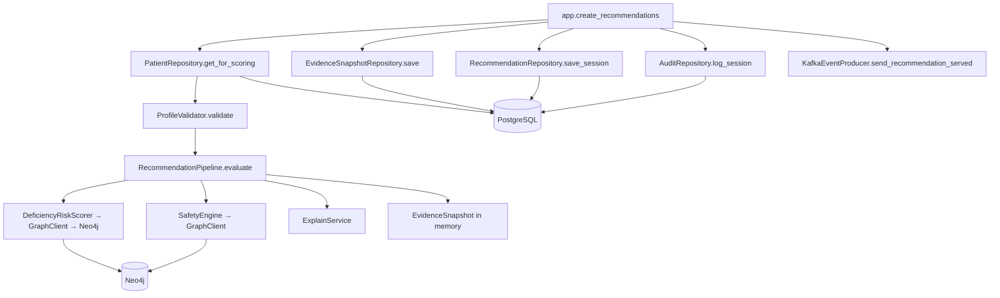

# `src/` Call Chain Reference

How code flows from the FastAPI entry point through business logic to database (and Neo4j) calls. Read **top-down** for request paths; use the **reverse index** at the bottom to see who calls each file.

**Entry point:** `src/api/app.py` (uvicorn loads `src.api.app:app`)

---

## Folder roles (quick map)

| Folder | Role | Touches DB? | Touches Neo4j? |
|--------|------|-------------|----------------|
| `src/api/` | HTTP layer, lifespan, middleware, request/response schemas | Yes (via repos) | Yes (read-only endpoints + pipeline) |
| `src/db/` | SQLAlchemy engine, ORM models, repositories (only SQL writers/readers) | **Yes** | No |
| `src/pipelines/` | Orchestration (`RecommendationPipeline`), Kafka events | Indirect (repos passed in) | Via `GraphClient` |
| `src/core/` | DRS scoring, candidates, dose, confidence | No | Via `GraphClient` |
| `src/safety/` | Deterministic safety gate | No | Via `GraphClient` |
| `src/explain/` | Template rationale text | No | No |
| `src/knowledge/` | Neo4j + Redis cache (`GraphClient`) | No | **Yes** |
| `src/personalization/` | Longitudinal DRS blend (optional flag) | Via `RecommendationRepository.get_last_drs_snapshot` | No |
| `src/intake/` | Profile validation, pilot fixtures, MRN hashing | Used by API + scripts | No |
| `src/shared/` | Frozen domain dataclasses (contract between layers) | No | No |

**Layer rule:** API and pipeline never import SQLAlchemy directly. They call **repositories** (`src/db/repositories.py`), which translate ORM ↔ `PatientProfile` / session objects in `src/shared/models.py`.

---

## Startup chain (before any HTTP request)

```
uvicorn → app.lifespan()
  ├── GraphClient.__init__()                    [knowledge/graph_client.py]
  ├── GraphClient.health_check()                → Neo4j
  ├── init_db()                                 [db/engine.py]
  ├── _load_active_model_version()
  │     ├── get_session()                       [db/engine.py]
  │     └── ModelVersionRepository.get_active() → Postgres SELECT model_versions
  ├── RecommendationPipeline.__init__()         [pipelines/recommendation_pipeline.py]
  │     ├── DeficiencyRiskScorer.__init__(graph_client)
  │     ├── CandidateGenerator.__init__(graph_client)
  │     ├── DoseOptimizer.__init__(graph_client)
  │     ├── SafetyEngine.__init__(graph_client)
  │     ├── ConfidenceCompositor.__init__()
  │     └── ExplainService.__init__()
  ├── PersonalizationEngine()                   [optional, personalization/engine.py]
  └── KafkaEventProducer.start()                [pipelines/kafka_producer.py]
```

Shutdown: `kafka_producer.stop()` → `graph_client.close()` → `close_db()`

---

## Per-request DB session injection

Every endpoint that writes/reads Postgres uses:

```
FastAPI Depends(get_session_dep)
  └── db/engine.py :: get_session_dep()
        └── get_session()  → async context manager
              ├── yield AsyncSession
              ├── commit on success
              └── rollback on exception
```

Repositories receive that `AsyncSession` in `__init__(session)`.

---

## Middleware order (every HTTP request)

```
Client
  → ApiKeyMiddleware.dispatch()     [api/middleware/api_key.py]  (if REQUIRE_API_KEY=1)
  → CORSMiddleware
  → request_context()               [api/app.py]  JSON access log + X-Request-ID
  → route handler
```

---

## Primary path: `POST /v1/recommendations`

Production uses `patient_id` only. Dev may use inline `patient` when `ALLOW_INLINE_PATIENT=1`.

### Forward call chain (numbered)

```
1.  app.py :: create_recommendations()
2.  db/engine.py :: get_session_dep()           → opens AsyncSession
3.  PatientRepository(session)                  [db/repositories.py]

    [Load patient]
4a. patient_repo.get_for_scoring(pid)            [production]
      ├── get(patient_id)
      │     └── SQL: SELECT patients + selectinload conditions/meds/labs
      │     └── _orm_to_profile(orm)
      └── _apply_read_controls(profile)         latest lab per LOINC, active meds

4b. _schema_to_domain(patient)                   [dev inline only]
      └── patient_repo.upsert(profile)
            ├── SQL: INSERT/UPDATE patients
            ├── sync_conditions() / sync_medications() / append_lab()

5.  ProfileValidator.validate(profile)          [intake/validator.py]
6.  RecommendationRepository(session)
7.  AuditRepository(session)
8.  EvidenceSnapshotRepository(session)

    [Score — no DB writes inside pipeline]
9.  RecommendationPipeline.evaluate()           [pipelines/recommendation_pipeline.py]
      ├── Stage 1: DeficiencyRiskScorer.score_all()
      │     └── per nutrient: score() → GraphClient (Neo4j + Redis)
      ├── Stage 1b [optional]: PersonalizationEngine
      │     ├── load_longitudinal_priors() → rec_repo.get_last_drs_snapshot() → Postgres
      │     └── apply_longitudinal_priors()
      ├── Stage 2: CandidateGenerator.generate() → GraphClient
      ├── Stage 3: DoseOptimizer.optimize() × N → GraphClient
      ├── Stage 4: SafetyEngine.run() → GraphClient
      ├── Stage 5: ConfidenceCompositor.compute/grade/rank_score
      ├── Stage 6: ExplainService.explain() × N  (CPU thread pool)
      └── Stage 7: _snapshot_evidence() → GraphClient.get_kg_version/get_kg_stats

    [Persist]
10. snapshot_repo.save()                        → INSERT evidence_snapshots
11. rec_repo.save_session(session_obj)          → INSERT recommendation_sessions,
                                                  recommendations, recommendation_warnings
12. audit_repo.log_session()                    → INSERT audit_log
13. KafkaEventProducer.send_recommendation_served()
14. _session_to_response()                      [app.py — domain → JSON]
15. get_session() commits transaction
```

### Mermaid (main score path)



---

## Other endpoints → DB / external calls

### Ops (no business repos)

| Endpoint | Handler | Calls |
|----------|---------|-------|
| `GET /health` | `health()` | `GraphClient.health_check()`, `check_postgres_health()` |
| `GET /health/live` | `health_live()` | none |
| `GET /health/ready` | `health_ready()` | same as `/health` |

### Patient deltas (Postgres write + Kafka)

| Endpoint | Handler | Repository methods | Other |
|----------|---------|-------------------|-------|
| `POST /v1/patients/{id}/labs` | `append_patient_lab()` | `exists()`, `append_lab()` → `patient_labs` | `_emit_patient_event()` |
| `POST /v1/patients/{id}/medications/sync` | `sync_patient_medications()` | `exists()`, `sync_medications()` | Kafka |
| `POST /v1/patients/{id}/conditions/sync` | `sync_patient_conditions()` | `exists()`, `sync_conditions()` | Kafka |

### Read endpoints (Postgres read only)

| Endpoint | Handler | Repository methods |
|----------|---------|-------------------|
| `GET /v1/sessions/{id}` | `get_recommendation_session()` | `get_session()`, `get_session_recommendations()` |
| `GET /v1/patients/{id}/history` | `patient_history()` | `get_patient_history()` |
| `GET /v1/audit/{id}` | `get_audit()` | `get_by_session()` |
| `GET /v1/evidence/{id}` | `get_evidence_snapshot()` | `get()` |
| `POST /v1/feedback` | `submit_feedback()` | `FeedbackRepository.save()` → `rec_feedback` |

### Neo4j-only (no Postgres)

| Endpoint | Handler | Calls |
|----------|---------|-------|
| `GET /v1/safety/check` | `safety_check()` | `GraphClient.get_interaction_edges()` |
| `GET /v1/nutrients/{id}` | `get_nutrient()` | `GraphClient.get_nutrient_meta()` |

---

## Pipeline internals (stage → class → external I/O)

| Stage | Class | Method | Neo4j methods used |
|-------|-------|--------|-------------------|
| 1 DRS | `DeficiencyRiskScorer` | `score_all()` → `score()` | `get_all_nutrient_ids`, `get_baseline_prevalence`, `get_condition_edges`, `get_depletion_edges`, `get_nutrient_meta` |
| 1b Personalization | `PersonalizationEngine` | `load_longitudinal_priors`, `apply_longitudinal_priors` | — (Postgres via `get_last_drs_snapshot`) |
| 2 Candidates | `CandidateGenerator` | `generate()` | `get_nutrient_meta`, `get_guideline` |
| 3 Dose | `DoseOptimizer` | `optimize()` | `get_nutrient_meta` |
| 4 Safety | `SafetyEngine` | `run()` | `get_interaction_edges`, `get_antagonist_pairs` |
| 5 Confidence | `ConfidenceCompositor` | `compute`, `grade`, `rank_score` | — |
| 6 Explain | `ExplainService` | `explain()` | — |
| 7 Snapshot | `RecommendationPipeline` | `_snapshot_evidence()` | `get_kg_version`, `get_kg_stats` |

---

## Reverse index: who calls each file

Listed **caller → callee**. Use this to understand why a module exists.

### `src/api/app.py`

**Called by:** uvicorn / test client  
**Calls:**
- `db/engine`: `init_db`, `close_db`, `get_session_dep`, `check_postgres_health`, `get_session`
- `db/repositories`: all repo classes
- `intake/validator`: `ProfileValidator`
- `knowledge/graph_client`: via `app_state.graph_client`
- `pipelines/recommendation_pipeline`: `RecommendationPipeline.evaluate`
- `pipelines/kafka_producer`: `KafkaEventProducer`
- `shared/models`: domain types for mapping
- Helpers: `_schema_to_domain`, `_session_to_response`, `_emit_patient_event`, `_hash_patient_id`

### `src/api/middleware/api_key.py`

**Called by:** FastAPI middleware stack (`app.add_middleware`)  
**Calls:** none in `src/` (checks env + header)

### `src/db/engine.py`

**Called by:** `app.lifespan`, `app._load_active_model_version`, all endpoints via `Depends(get_session_dep)`, health checks  
**Calls:** SQLAlchemy only

### `src/db/orm_models.py`

**Called by:** `db/repositories.py` only (ORM layer)  
**Calls:** none

### `src/db/repositories.py`

**Called by:** `app.py` (all DB endpoints), `personalization/engine.py` (`get_last_drs_snapshot`), scripts/tests  
**Calls:** `orm_models`, `shared/models`, SQLAlchemy `select`/`update`  
**Key translators:** `_orm_to_profile`, `_apply_read_controls`, `_rec_orm_to_dict`

| Repository | Write tables | Read tables |
|------------|--------------|-------------|
| `PatientRepository` | `patients`, `patient_conditions`, `patient_medications`, `patient_labs`, `ingest_batches` | same |
| `RecommendationRepository` | `recommendation_sessions`, `recommendations`, `recommendation_warnings` | same |
| `AuditRepository` | `audit_log` | `audit_log` |
| `EvidenceSnapshotRepository` | `evidence_snapshots` | `evidence_snapshots` |
| `FeedbackRepository` | `rec_feedback` | `rec_feedback` |
| `ModelVersionRepository` | `model_versions` | `model_versions` |

### `src/pipelines/recommendation_pipeline.py`

**Called by:** `app.create_recommendations`  
**Calls:** `core/*`, `safety/safety_engine`, `explain/explain_service`, `knowledge/graph_client`, `personalization/engine` (optional), `shared/models`

### `src/pipelines/kafka_producer.py`

**Called by:** `app.lifespan`, `app.create_recommendations`, delta endpoints via `_emit_patient_event`  
**Calls:** aiokafka (external)

### `src/core/deficiency_risk_scorer.py`

**Called by:** `RecommendationPipeline.evaluate` (stage 1)  
**Calls:** `GraphClient` (all DRS graph reads)

### `src/core/candidate_generator.py`

**Called by:** `RecommendationPipeline.evaluate` (stages 2–3–5)  
**Classes:** `CandidateGenerator`, `DoseOptimizer`, `ConfidenceCompositor`  
**Calls:** `GraphClient` (candidate + dose paths)

### `src/safety/safety_engine.py`

**Called by:** `RecommendationPipeline.evaluate` (stage 4)  
**Calls:** `GraphClient.get_interaction_edges`, `get_antagonist_pairs`

### `src/explain/explain_service.py`

**Called by:** `RecommendationPipeline.evaluate` (stage 6, via `asyncio.to_thread`)  
**Calls:** `shared/models` only

### `src/knowledge/graph_client.py`

**Called by:** pipeline stages, `app.health*`, `app.safety_check`, `app.get_nutrient`, DRS/Candidate/Safety constructors  
**Calls:** Neo4j driver, Redis (optional cache)

### `src/personalization/engine.py`

**Called by:** `RecommendationPipeline.evaluate` when `PERSONALIZATION_ENABLED=1`  
**Calls:** `RecommendationRepository.get_last_drs_snapshot`

### `src/intake/validator.py`

**Called by:** `app.create_recommendations`  
**Calls:** `shared/models`

### `src/intake/identity.py`

**Called by:** scripts / external feeder (not HTTP hot path)  
**Function:** `compute_hashed_mrn()`

### `src/intake/pilot_cohort.py`

**Called by:** `scripts/seed_patient_realm.py`, tests  
**Calls:** `shared/models`, `intake/identity`

### `src/shared/models.py`

**Called by:** every layer above repositories  
**Role:** frozen dataclasses — no I/O

### `src/pipelines/dags/dag_patient_bulk_sync.py`

**Called by:** Airflow (optional dev ETL — not production hot path)  
**Not wired into FastAPI**

---

## Function catalog by file

### `src/api/app.py`

| Function | Role |
|----------|------|
| `lifespan()` | Startup/shutdown wiring |
| `_load_active_model_version()` | Read active model from Postgres |
| `_emit_patient_event()` | Kafka wrapper for delta endpoints |
| `request_context()` | Structured HTTP logging middleware |
| `health()`, `health_live()`, `health_ready()` | Ops probes |
| `create_recommendations()` | **Main score endpoint** |
| `append_patient_lab()` | Delta lab ingest |
| `sync_patient_medications()` | Delta med sync |
| `sync_patient_conditions()` | Delta condition sync |
| `get_recommendation_session()` | Read session |
| `patient_history()` | Read history |
| `submit_feedback()` | Write feedback |
| `get_audit()` | Read audit |
| `get_evidence_snapshot()` | Read KG snapshot |
| `safety_check()` | Neo4j interaction lookup |
| `get_nutrient()` | Neo4j nutrient meta |
| `_schema_to_domain()` | Pydantic → `PatientProfile` |
| `_session_to_response()` | `RecommendationSession` → JSON |

### `src/db/repositories.py`

| Class / function | Role |
|------------------|------|
| `PatientRepository.get_for_scoring` | Production patient load for scoring |
| `PatientRepository.get` | Raw profile load |
| `PatientRepository.upsert` | Dev inline patient write |
| `PatientRepository.append_lab` | Append lab row |
| `PatientRepository.sync_medications` | Replace active meds |
| `PatientRepository.sync_conditions` | Upsert conditions |
| `PatientRepository.exists` | PK existence check |
| `PatientRepository.log_ingest_batch` | Batch metadata (feeder/scripts) |
| `RecommendationRepository.save_session` | Persist full session |
| `RecommendationRepository.get_session` | Session metadata |
| `RecommendationRepository.get_session_recommendations` | Recs + warnings |
| `RecommendationRepository.get_patient_history` | Recent sessions |
| `RecommendationRepository.get_last_drs_snapshot` | Personalization prior |
| `AuditRepository.log_session` | Append audit row |
| `AuditRepository.get_by_session` | Read audit |
| `EvidenceSnapshotRepository.save` / `get` | KG snapshot persistence |
| `FeedbackRepository.save` / `get_for_retraining` | Feedback loop |
| `ModelVersionRepository.get_active` / `promote` | Model registry |

### `src/pipelines/recommendation_pipeline.py`

| Function | Role |
|----------|------|
| `RecommendationPipeline.evaluate()` | **Orchestrates all 7 stages** |
| `_snapshot_evidence()` | Build in-memory `EvidenceSnapshot` |
| `_build_handoff()` | Clinician escalation text |
| `_review_schedule()` | Follow-up weeks heuristic |

### `src/knowledge/graph_client.py`

| Method | Cypher / cache purpose |
|--------|------------------------|
| `get_baseline_prevalence` | `Demographic -[:HAS_BASELINE_RISK]-> Nutrient` |
| `get_condition_edges` | `INCREASES_DEMAND_FOR`, `CAUSES_MALABSORPTION_OF` |
| `get_depletion_edges` | `DEPLETES` |
| `get_interaction_edges` | `INTERACTS_WITH` |
| `get_antagonist_pairs` | `ANTAGONIZES` |
| `get_contraindications` | `CONTRAINDICATED_IN` |
| `get_guideline` | `Guideline -[:RECOMMENDS]-> Nutrient` |
| `get_nutrient_meta` | `Nutrient` node properties |
| `get_all_nutrient_ids` | List all nutrients |
| `get_kg_version` / `get_kg_stats` | Snapshot metadata |

---

## Mental model

```
HTTP (app.py)
  → validate / load patient (intake + PatientRepository → Postgres)
  → score (RecommendationPipeline → core + safety + explain → Neo4j)
  → persist (RecommendationRepository + AuditRepository + EvidenceSnapshotRepository → Postgres)
  → notify (KafkaEventProducer → optional)
```

Neo4j is **read-only at runtime** in this service. Postgres holds PHI, sessions, audit, and feedback. Domain types in `shared/models.py` are the glue — repositories and pipeline never pass ORM objects upward.

---

## Related docs

- `ENGINE_MASTER_REFERENCE.md` — ops, Docker, gates, API summary
- `supplement_engine_brd.html` — schema tables, ERD, sequence diagrams (`#engine-reference`)
- `etl/PATIENT_REALM_CONTRACT.md` — external bulk feeder → same Postgres tables
